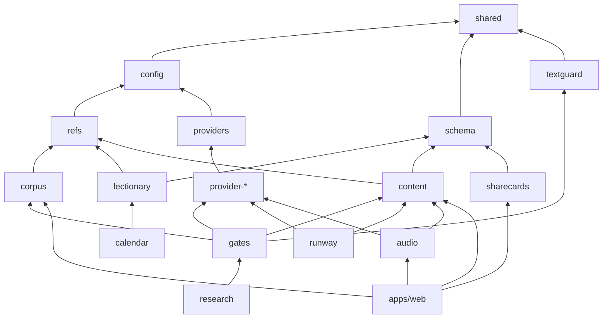

# Architecture

**Generate once, serve forever.** The lectionary repeats (Sundays on a three-year cycle, weekdays on a two-year
cycle), so notes are stored against the passage, not the date, as plain JSON files in this repository. Each verified
note is a permanent asset, and the product is a static site with no backend. Users never trigger AI: research
happens weeks ahead, lands through a checked pull request, and once a passage is done it is done for every future
year it appears.

```mermaid
flowchart LR
  subgraph local["Owner's machine (L-034…L-038)"]
    cal["calendar/&lt;year&gt;.json<br/>upcoming passages"] --> plan["research CLI<br/>plan: skip passages<br/>already in the repo"]
    plan --> agent["research agent<br/>LLM + web search"]
    agent --> pre["pre-validate<br/>gates 1–3 + repair"]
  end

  pre -->|"one PR per passage<br/>passages/&lt;key&gt;.json"| pr["Pull request"]

  subgraph gh["GitHub: the single source of truth"]
    pr --> g1["1 · schema"] --> g2["2 · evidence"] --> g3["3 · licence guard"]
    g3 --> g4["4 · two-family<br/>LLM verifiers"] --> g5{"5 · merge rule"}
    g5 -->|"all green,<br/>high confidence"| approve["approval commit<br/>(review block, auto)"]
    g5 -->|"flagged"| human["human reviewer<br/>label or /approve"]
    human --> approve
    approve --> merge["merge to main"]
  end

  merge --> deploy["deploy workflow<br/>Astro build + JSON API"]
  deploy --> audio["narration rendered<br/>in CI (TTS)"]
  audio --> storage[("object storage<br/>audio by text hash")]
  deploy --> pages["GitHub Pages<br/>static PWA"]
  pages --> web["Web readers<br/>share links, offline"]
  pages -->|"same JSON (/api/v1)"| flutter["Flutter apps<br/>Android · iOS"]
  storage --> web
  storage --> flutter
```

## The pieces

| Stage            | Where                                 | What happens                                                                                                                                             | Issues             |
| ---------------- | ------------------------------------- | -------------------------------------------------------------------------------------------------------------------------------------------------------- | ------------------ |
| Calendar         | `packages/calendar`, `calendar/`      | romcal + Kenya overrides + lectionary data → `calendar/<year>.json` (date → celebrations, colour, passage refs, link-outs). Computed, rebuilt yearly.    | L-014–L-017, L-070 |
| Research         | `packages/research` (local CLI)       | Lists upcoming passages, skips those already in the repo or with an open PR, researches each with an LLM and web search, pre-validates, opens a PR.      | L-034–L-038, L-072 |
| Gates            | `packages/gates`, `content-gates.yml` | Schema → evidence → licence guard (deterministic, cheap) → two LLM verifiers from different families → merge rule. A failed check never closes a PR.     | L-023–L-031        |
| Approval         | merge-rule job                        | Auto-merge candidates and human approvals (label or `/approve` by a configured reviewer) become one signed approval commit that writes the review block. | L-028, L-031       |
| Build and deploy | `apps/web`, `deploy.yml`              | Astro builds real HTML pages, the static JSON API and share cards; Pagefind indexes; GitHub Pages serves. Rebuilt on merge and daily.                    | L-050–L-064        |
| Audio            | `packages/audio`, deploy              | Narration rendered in CI, keyed by a hash of the text, stored in object storage; re-rendered only when text changes.                                     | L-080–L-085        |
| Apps             | `apps/mobile`                         | Flutter reads the same `/api/v1` JSON the site publishes; no separate API.                                                                               | L-100–L-117        |

The five content gates, rule by rule, are in [gates.md](gates.md); what a reviewer checks on a flagged PR, and how to
approve it, is in the [reviewer guide](reviewer-guide.md).

## Principles

- **The repository decides what is true.** One JSON file per passage; git history is the audit trail. There is no
  database, no API server and nothing to operate. If every AI provider went down, the site would keep serving.
- **Commentary only.** The reading text is never stored: only references and link-outs to a licensed or public-domain
  text ([ADR 0003](adr/0003-never-store-reading-text.md)).
- **Content keyed by passage** ([ADR 0002](adr/0002-content-keyed-by-passage.md)) with canonical keys such as
  `MT.20.1-16` ([ADR 0004](adr/0004-passage-keys-and-book-codes.md)).
- **Providers behind interfaces.** LLMs, web fetch, TTS, storage and GitHub are interfaces with deterministic fakes;
  live implementations are separate packages injected at the edges
  ([ADR 0005](adr/0005-providers-behind-interfaces.md)). LLM and TTS keys live only on the owner's machine and in CI
  secrets for the online jobs.
- **Offline unit CI with a 96% floor** ([ADR 0006](adr/0006-coverage-floor.md)). Only the content-gates workflow
  goes online.

## Monorepo

TypeScript on Node 22 with npm workspaces ([ADR 0001](adr/0001-typescript-npm-workspaces.md)). Dependency direction
(arrows point at dependencies):

Each package's `package.json` lists the exact set; they were all written by L-001 so implementing issues never edit
a manifest or the lockfile.
